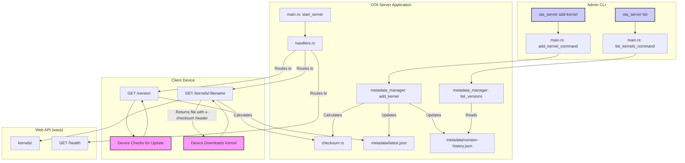

# OTA Server Project Documentation

This document provides an overview of the OTA (Over-the-Air) server project, its design, architecture, and how to use it.

## Project Summary & Architecture

This OTA update server is a well-designed Rust application with a modular structure. It serves kernel updates to client devices and provides a command-line interface (CLI) for administration.

- **Configuration**: The server is configured via a TOML file (`config/server.toml`), allowing easy management of server settings and file paths.
- **Web Server**: A `warp` web server exposes API endpoints for clients to check for new versions and download kernel files.
- **CLI**: A `clap`-based CLI facilitates administrative tasks like adding new kernel versions and listing available versions.
- **Metadata Management**: The `MetadataManager` handles all kernel metadata, which is stored in JSON format (`metadata/latest.json` and `metadata/version-history.json`).
- **File Integrity**: SHA-256 checksums are used to ensure the integrity of kernel files during transfer.

## Architecture Flow

There are two primary workflows for the OTA server:

1.  **Admin Flow (CLI)**:
    - An administrator uses the CLI to add a new kernel.
    - The `main.rs` module parses the command and arguments.
    - `MetadataManager` is invoked to:
        - Calculate the SHA-256 checksum of the kernel file.
        - Create new metadata for the kernel.
        - Update `metadata/latest.json` with the new version information.
        - Append the new version to `metadata/version-history.json`.

2.  **Client Flow (API)**:
    - A client device sends a request to the `GET /version` endpoint to check for the latest kernel version.
    - If an update is available, the device sends a request to `GET /kernels/<filename>` to download the kernel file.
    - The server responds with the kernel file and an `x-checksum` header containing the SHA-256 checksum.
    - The client can then verify the integrity of the downloaded file using the checksum.

## Mermaid Diagram

The following diagram illustrates the architecture of the OTA server:

## Implementation Details (File-by-File)

This section provides a detailed breakdown of each file in the `src` directory, explaining their roles and functionalities.

### `main.rs`

- **Purpose**: This is the entry point of the application. It initializes the command-line interface (CLI) and orchestrates the different parts of the server.
- **Functionality**:
    - **CLI Parsing**: It uses the `clap` crate to parse command-line arguments.
    - **Command Handling**: Based on the parsed command (`start`, `add-kernel`, or `list`), it calls the appropriate function.
    - **Server Initialization**: The `start_server` function configures and starts the `warp` web server. It sets up the API routes and binds to the specified address.
    - **Admin Commands**: The `add_kernel_command` and `list_kernels_command` functions handle the administrative tasks of adding new kernels and listing existing ones. They interact with the `MetadataManager` to perform these operations.

### `cli.rs`

- **Purpose**: Defines the structure and commands of the command-line interface using the `clap` crate.
- **Functionality**:
    - **`Cli` Struct**: The main struct that represents the CLI.
    - **`Commands` Enum**: Defines the available subcommands:
        - `Start`: To start the web server. It takes an optional `--config` argument.
        - `AddKernel`: To add a new kernel version. It requires `--version`, `--file`, and `--description` arguments.
        - `List`: To list all available kernel versions.

### `config.rs`

- **Purpose**: Manages the server's configuration.
- **Functionality**:
    - **`ServerConfig` Struct**: Holds the entire configuration, including server settings (`host`, `port`) and file paths (`kernels_dir`, `metadata_dir`).
    - **Loading from File**: The `load_from_file` function reads a TOML configuration file and deserializes it into a `ServerConfig` struct.
    - **Default Configuration**: Implements the `Default` trait to provide a fallback configuration if the specified file is not found.
    - **Directory Management**: The `ensure_directories` function ensures that the kernel and metadata directories exist, creating them if necessary.

### `metadata.rs`

- **Purpose**: Defines the data structures for kernel metadata.
- **Functionality**:
    - **`KernelInfo` Struct**: Represents the metadata for a single kernel version, including its version, filename, size, checksum, release date, and description.
    - **`VersionResponse` Struct**: A struct used for the `/version` API endpoint, containing information about the latest kernel.
    - **`VersionHistory` Struct**: A struct that holds a list of all kernel versions and a reference to the latest version.

### `metadata_manager.rs`

- **Purpose**: Handles all operations related to kernel metadata.
- **Functionality**:
    - **`MetadataManager` Struct**: Manages the paths to the kernels and metadata directories.
    - **Adding Kernels**: The `add_kernel` function:
        - Calculates the SHA-256 checksum of the kernel file.
        - Creates a `KernelInfo` struct with the new metadata.
        - Updates `metadata/latest.json` with the new version.
        - Appends the new version to `metadata/version-history.json`.
    - **Listing Versions**: The `list_versions` function reads `metadata/version-history.json` and returns the list of all available kernel versions.

### `checksum.rs`

- **Purpose**: Provides functionality for calculating file checksums.
- **Functionality**:
    - **`calculate_file_checksum` Function**: Takes a file path and calculates its SHA-256 checksum. It reads the file in chunks to handle large files efficiently.
    - **Checksum Verification**: The `_verify_checksum` function (used for testing) can be used to verify a checksum against a given data buffer.

### `handlers.rs`

- **Purpose**: Contains the `warp` handlers for the API endpoints.
- **Functionality**:
    - **`/health` Endpoint**: A simple health check endpoint that returns a "healthy" status.
    - **`/version` Endpoint**:
        - Reads `metadata/latest.json`.
        - Returns the latest kernel version information as a JSON response.
    - **`/kernels/:filename` Endpoint**:
        - Serves a kernel file from the `kernels` directory.
        - Calculates the file's checksum and includes it in the `x-checksum` response header for client-side verification. 