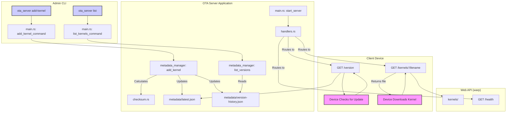

# OTA (Over-The-Air) Update Server

A simple, robust server for managing and distributing firmware/kernel updates for IoT devices. This server provides a RESTful API for devices to check for new versions and download them. It also includes a command-line interface for easy administration.

---

## ✨ Features

- **RESTful API**: Simple endpoints for version checks and kernel downloads.
- **CLI Administration**: Easy-to-use commands for adding and listing kernel versions.
- **mDNS Service Discovery**: Devices can automatically discover the OTA server on the local network.
- **Configuration-driven**: Server behavior is controlled via a simple TOML configuration file.
- **Checksum Verification**: Ensures integrity of kernel files (future implementation).

---

## 📂 Project Structure

The project is organized into several modules, each with a specific responsibility:

| Module               | Description                                                                                              |
| -------------------- | -------------------------------------------------------------------------------------------------------- |
| `main.rs`            | The main entry point of the application. Handles CLI command parsing and dispatches to the correct logic.  |
| `cli.rs`             | Defines the command-line interface structure and arguments using the `clap` crate.                       |
| `config.rs`          | Manages server configuration, loading settings from a `server.toml` file.                                |
| `handlers.rs`        | Contains the `warp` web handlers for the API endpoints (`/health`, `/version`, `/kernels`).                |
| `metadata.rs`        | Defines the data structures for kernel metadata (e.g., `KernelInfo`, `VersionHistory`).                  |
| `metadata_manager.rs`| Handles the logic for reading, writing, and managing kernel metadata files.                              |
| `checksum.rs`        | A utility module for calculating file checksums to ensure data integrity.                                |
| `mdns.rs`            | Implements mDNS/DNS-SD service advertisement to make the server discoverable on the local network.         |

---

## 🌊 Control Flow

There are two primary workflows in this application: the **Admin Flow** (for managing kernels via the CLI) and the **Client Flow** (for devices to check and download updates via the API).

### 1. Admin Flow (CLI)

This flow is initiated by an administrator using the command line to manage kernel versions.

1.  **Command Execution**: An admin runs a command like `cargo run -- add-kernel ...` or `cargo run -- list`.
2.  **CLI Parsing**: `main.rs` receives the command-line arguments, and `clap` (in `cli.rs`) parses them into a structured `Cli` command.
3.  **Command Dispatch**: Based on the command (`AddKernel` or `List`), `main.rs` calls the corresponding function (`add_kernel_command` or `list_kernels_command`).
4.  **Metadata Management**: The dispatched function creates an instance of `MetadataManager`.
    -   **For `add-kernel`**: The `add_kernel` method is called. It calculates the new kernel file's checksum, creates metadata, and updates `latest.json` and `version-history.json`.
    -   **For `list`**: The `list_versions` method is called. It reads `version-history.json` and prints a formatted list to the console.

### 2. Client Flow (API)

This flow is initiated by a device on the network checking for or downloading an update.

1.  **Server Start**: The server must be running via the `cargo run -- start` command. `main.rs` starts the `warp` server, which listens for HTTP requests.
2.  **Service Discovery**: A client device can discover the OTA server's IP address and port by listening for the `_ota._tcp.local` mDNS advertisement.
3.  **API Request**: The device sends an HTTP `GET` request to an API endpoint (e.g., `/version`).
4.  **Request Handling**: `warp` routes the request to the appropriate handler in `handlers.rs`.
    -   **For `/version`**: The handler reads `latest.json` and returns the latest kernel's metadata as a JSON response.
    -   **For `/kernels/<filename>`**: The handler finds the requested file in the `kernels` directory and streams it back to the client.

### Architecture Diagram

The following diagram visualizes the interaction between the different components:



---

## ⚙️ Configuration

The server is configured using the `config/server.toml` file. If the file is not found, default values are used.

```toml
# config/server.toml

[server]
host = "0.0.0.0"
port = 8080

[paths]
kernels_dir = "./kernels"
metadata_dir = "./metadata"
```

---

## 🚀 Usage

### Running the Server

To start the server, use the `start` command. It will host the API and advertise itself via mDNS.

<pre style="background-color:#2d2d2d; color:#feda75; padding:1em; border-radius:5px;">
cargo run -- start --config config/server.toml
</pre>

### Managing Kernels

You can manage kernel versions using the CLI.

**1. Add a New Kernel Version**

This command adds a new kernel file to the metadata, making it available for devices.

<pre style="background-color:#2d2d2d; color:#81a1c1; padding:1em; border-radius:5px;">
cargo run -- add-kernel --version "v1.0.1" --file "path/to/kernel.img" --description "Bug fixes and performance improvements." --config config/server.toml
</pre>

**2. List Available Kernels**

This command displays the latest version and a history of all available kernel versions.

<pre style="background-color:#2d2d2d; color:#a3be8c; padding:1em; border-radius:5px;">
cargo run -- list --config config/server.toml
</pre>

---

## 🌐 API Endpoints

The server exposes the following endpoints:

| Method | Path                  | Description                                            |
| ------ | --------------------- | ------------------------------------------------------ |
| `GET`  | `/health`             | A simple health check endpoint. Returns `200 OK`.      |
| `GET`  | `/version`            | Returns metadata for the latest available version.     |
| `GET`  | `/version/history`    | Returns the complete version history.                  |
| `GET`  | `/kernels/<filename>` | Downloads the specified kernel file.                   |

This provides a clear and useful `PROJECT_OVERVIEW.md` for your project. 